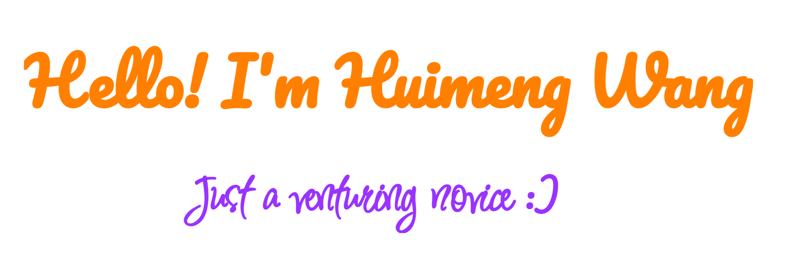

____________________________________________
### About me:
- 😄 Pronouns: He/Him
- 👋 An final year student majoring in Automation at [XJTU](https://www.xjtu.edu.cn)
- 🏫 An incoming Ph.D. student at [CUHK](https://www.cuhk.edu.hk/chinese/)
- 📈 Just a novice in speech and language processing
- ❤️ I love coding, and strive to become a highly qualified deep learning engineer
- 💬 Ask me about anything [here](https://github.com/echo-hmwang/echo-hmwang/issues)
### Contact me:

 

___________________________________________________________________________________________________________

### 📊GitHub Stats:

 

|  |
| ------------------------------------------------- |

